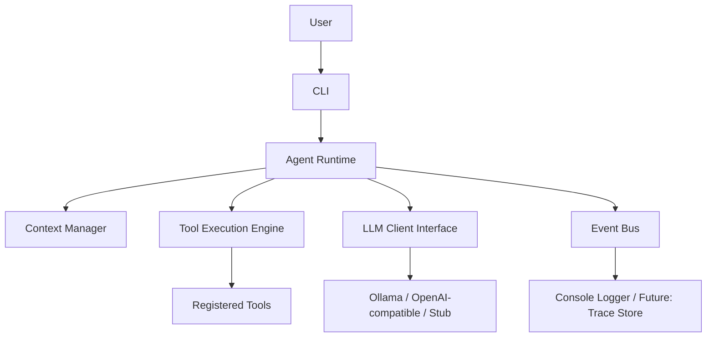
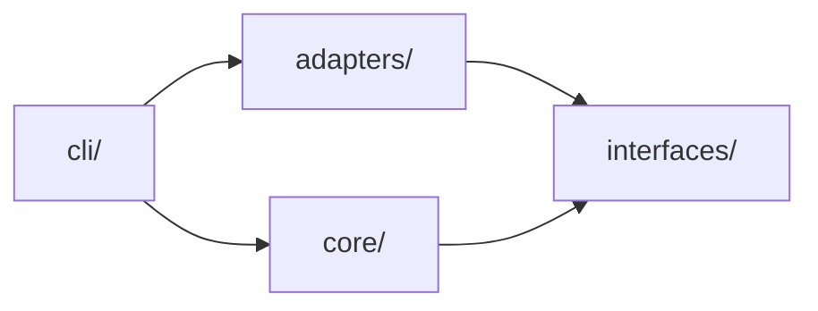

# High-Level Design — Kernel

## 1. System Overview

Kernel is a layered, event-driven AI Agent Platform. The **runtime is the product**; every capability beyond
the runtime (tools, connectors, retrieval, memory, orchestration) is added without modifying the runtime's
core.

This matches idea.md's high-level architecture (`User → CLI/API/UI → Agent Runtime → Planner → Tool
Execution Engine → Plugin Manager → Plugins → LLM`), simplified for Phase 1 since there is no planner or
plugin manager yet — the runtime calls the tool executor and LLM client directly.

## 2. Layering (Clean Architecture)

- **`core/`** — domain logic: conversation state, context management, tool execution loop, agent runtime
  orchestration, event/message models. No I/O, no third-party SDKs, no knowledge of concrete adapters.
- **`interfaces/`** — `Protocol`/`ABC` contracts: `LLMClient`, `Tool`, `EventBus`. Owned by the domain; both
  `core/` and `adapters/` depend on these, never the reverse.
- **`adapters/`** — concrete implementations: local-LLM client, stub LLM client (for tests), example tool,
  in-memory event bus, console event subscriber.
- **`cli/`** — entry point only: argument parsing (Typer) and composition root (wiring adapters into core).

Dependency direction is one-way: `cli → adapters → interfaces ← core`. `core` never imports `adapters` or
`cli`.

## 3. Cross-Cutting Concerns

- **Event-driven**: all significant actions publish an `Event` through the `EventBus` interface instead of
  ad-hoc logging. Phase 1 ships an in-memory synchronous bus + console subscriber; later phases can add a
  persistent trace store without touching `core/`.
- **LLM-agnostic**: all model calls go through `LLMClient`. Swapping Ollama for OpenAI-compatible or a test
  stub requires no core change.
- **Observability**: every event carries a correlation id (conversation/session id) so later phases (6) can
  build tracing/timeline views on top without changing the event schema's intent.

## 4. Tech Stack (Phase 1)

Python 3.11+, Typer (CLI), `httpx` (local LLM HTTP calls), `pytest` (tests), `black` + `ruff` (formatting /
linting). No database, no web framework, no vector store — none are needed yet.

## 5. Phase Extension Points (for future phases, not built now)

- Phase 2 (plugins) will introduce a Plugin Manager that discovers and registers `Tool` implementations
  dynamically instead of the manual registration used in Phase 1 — the `Tool` interface itself does not
  change.
- Phase 4 (RAG) will add `Embedder`/`VectorStore`/`Retriever` interfaces alongside the existing `LLMClient`
  interface, not inside it.
- Phase 5 (memory) will add a `MemoryStore` interface consumed by the `ContextManager`, replacing the
  in-process `ConversationState` list with a persisted equivalent behind the same shape.
- Phase 6 (tracing) will add a durable `EventSink` implementation; the `EventBus` interface does not change.

## 6. Risks & Alternatives

| Risk | Mitigation |
|---|---|
| Layer boundaries erode over time | Import-direction is documented in copilot-instructions.md; reviewed per PR |
| Local LLM unavailable in CI/dev | Stub `LLMClient` adapter is the default for tests |
| Event bus becomes a bottleneck later | Phase 1 keeps it synchronous/in-memory by design; swap-in async/durable bus is an adapter-only change |
