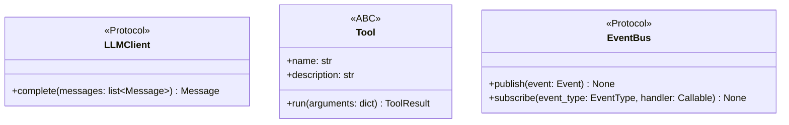
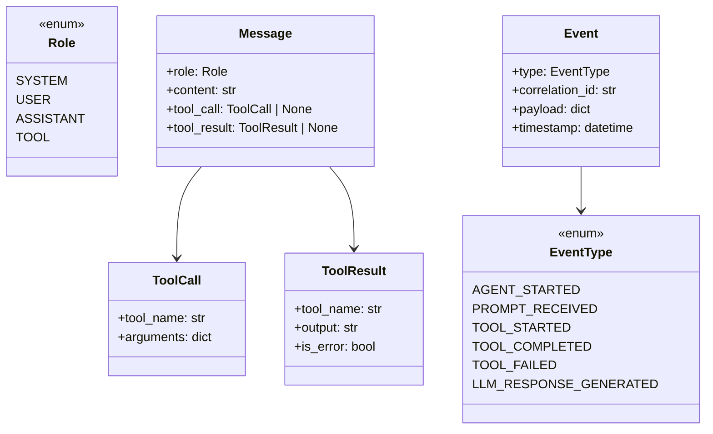
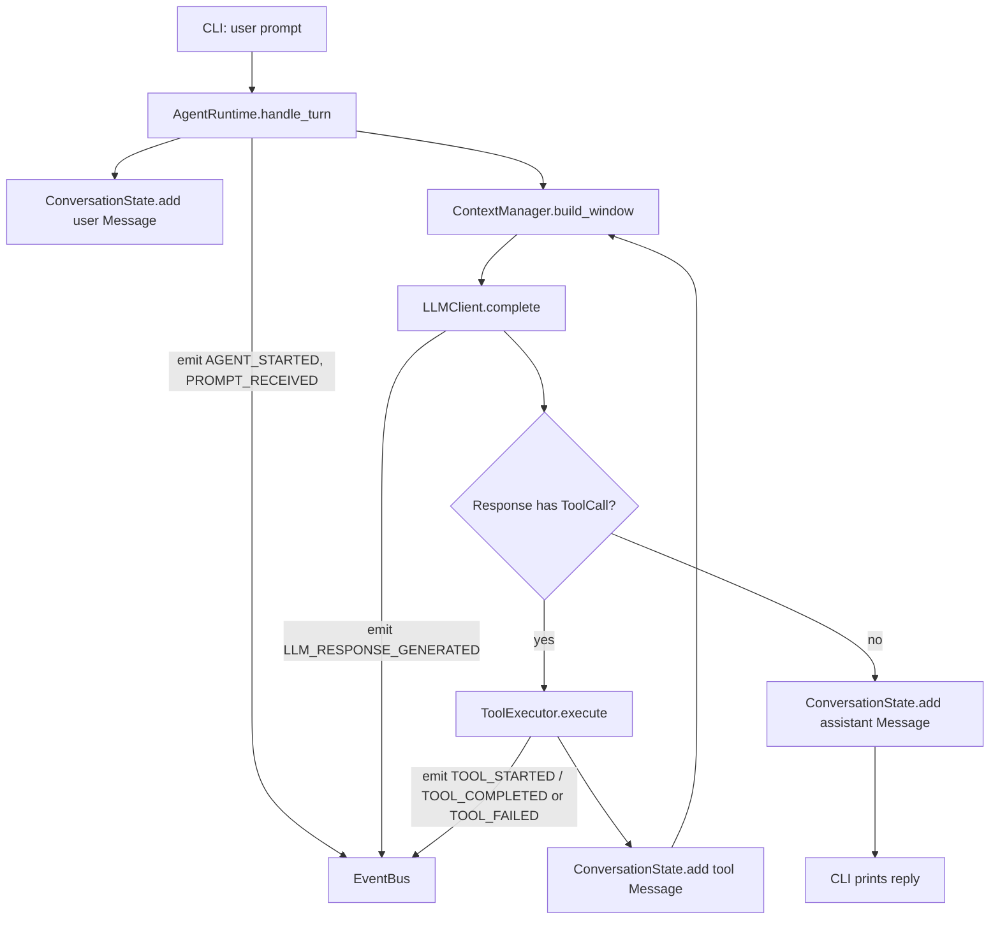

# Low-Level Design — Phase 1 (Minimal Agent Runtime)

## 1. Scope

CLI, LLM client interface, conversation state, context manager, tool execution loop, event bus. See
[PRD.md](../PRD.md) §5 and [idea.md](../../idea.md) Phase 1 for the authoritative scope/non-scope.

## 2. Folder Structure

```
src/kernel/
  core/
    models.py            # Message, Role, ToolCall, ToolResult, Event, EventType (dataclasses/enums)
    conversation.py       # ConversationState: append/get message history
    context_manager.py    # ContextManager: builds bounded message window for the LLM call
    tool_executor.py       # ToolExecutor: runs a ToolCall against registered Tools, emits events
    agent_runtime.py       # AgentRuntime: orchestrates one turn (prompt -> LLM -> optional tool loop -> reply)
  interfaces/
    llm_client.py          # LLMClient Protocol
    tool.py                 # Tool ABC
    event_bus.py            # EventBus Protocol
  adapters/
    llm/
      stub_llm_client.py    # Deterministic LLMClient for tests/offline use
      ollama_llm_client.py  # Real LLMClient backed by local Ollama HTTP API
    tools/
      echo_tool.py          # Minimal example Tool proving the tool-execution loop
    events/
      in_memory_event_bus.py  # Synchronous in-process EventBus implementation
      console_event_logger.py # Subscriber that prints events to stderr
  cli/
    main.py                 # Typer app + composition root (wires adapters into core) + `chat` command

mermaids/                   # 1:1 mirror of src/kernel/**, one .md per source file
tests/                      # 1:1 mirror of src/kernel/**, one test module per source file
```

## 3. Interfaces



## 4. Core Domain Model



## 5. Runtime Collaboration (one turn)



Loop bound: Phase 1 caps tool-call iterations per turn (e.g., `max_tool_iterations=5`, constructor
parameter on `AgentRuntime`) to avoid infinite loops — no configuration system yet, just a constructor
default.

## 6. Component Responsibilities

- **`ConversationState`** — in-memory ordered list of `Message`. No pruning logic itself.
- **`ContextManager`** — given `ConversationState` + a max-message (or max-char, Phase 1 keeps token counting
  simple) budget, returns the subset/window of messages to send to the LLM. Pluggable truncation strategy,
  but only one strategy (drop-oldest) implemented in Phase 1.
- **`ToolExecutor`** — holds a `dict[str, Tool]` registry (manually populated in the CLI composition root,
  not discovered), executes a single `ToolCall`, catches tool exceptions and turns them into a `ToolResult`
  with `is_error=True`, publishes lifecycle events.
- **`AgentRuntime`** — the only class that sequences the turn: conversation update → context build → LLM
  call → optional bounded tool loop → final assistant message. Depends only on `LLMClient`, `EventBus`,
  `ToolExecutor`, `ContextManager`, `ConversationState` — all via constructor injection.
- **`StubLLMClient`** — deterministic canned/echo-style responses; used in unit tests and as CLI default
  when no local LLM is configured.
- **`OllamaLLMClient`** — calls a local Ollama server's `/api/chat` endpoint via `httpx`; real but optional
  (network call only happens if user selects it).
- **`EchoTool`** — trivial tool (returns its input argument) proving the tool-call round trip works.
- **`InMemoryEventBus`** — synchronous dict-of-lists pub/sub.
- **`console_event_logger`** — a plain function subscribed to all event types that prints a one-line log.

## 7. Acceptance Criteria

1. Running `kernel chat "hello"` (stub mode, default) returns a deterministic assistant reply with exit code 0.
2. A prompt that triggers `EchoTool` (e.g., `kernel chat "echo:hi"` per stub convention) results in a
   `TOOL_STARTED` and `TOOL_COMPLETED` event and a final assistant message containing the tool output.
3. `AgentRuntime`, `ConversationState`, `ContextManager`, `ToolExecutor` have zero imports from `adapters/`
   or `cli/` (verified by unit tests importing only `core` + `interfaces`).
4. All 4 core event types (`AGENT_STARTED`, `PROMPT_RECEIVED`, `TOOL_STARTED`/`TOOL_COMPLETED`,
   `LLM_RESPONSE_GENERATED`) are observed at least once in a full turn integration test.
5. `black --check`, `ruff check`, and `pytest` all pass with zero errors/warnings.
6. Every `src/kernel/**/*.py` file has a companion `mermaids/kernel/**/*.md` file.

## 8. Implementation Tasks

1. Scaffold `pyproject.toml`, package skeleton, empty `__init__.py`s.
2. Implement `core/models.py` (+ tests).
3. Implement `interfaces/` (`llm_client.py`, `tool.py`, `event_bus.py`).
4. Implement `core/conversation.py`, `core/context_manager.py` (+ tests).
5. Implement `adapters/events/in_memory_event_bus.py`, `console_event_logger.py` (+ tests).
6. Implement `core/tool_executor.py` + `adapters/tools/echo_tool.py` (+ tests).
7. Implement `adapters/llm/stub_llm_client.py`, `adapters/llm/ollama_llm_client.py` (+ tests for stub;
   Ollama adapter covered by a mocked-HTTP unit test, not a live integration test).
8. Implement `core/agent_runtime.py` (+ unit tests with fakes, + one integration test wiring real adapters
   except network).
9. Implement `cli/main.py` (Typer command + composition root).
10. Write mermaid diagram per source file under `mermaids/`.
11. Run `black`, `ruff`, `pytest`; fix until clean.

## 9. Testing Strategy

- **Unit tests** (`tests/core/**`, `tests/interfaces/**` not needed since Protocols have no logic): mock
  `LLMClient`/`EventBus`/`Tool` — no network/filesystem.
- **Adapter tests** (`tests/adapters/**`): `StubLLMClient` tested directly; `OllamaLLMClient` tested with a
  mocked `httpx` transport (no real network call in CI).
- **Integration test** (`tests/integration/test_agent_turn.py`): wires `AgentRuntime` with
  `InMemoryEventBus` + `StubLLMClient` + `EchoTool`, asserts full event sequence and final reply — no real
  network, allowed to use local in-memory adapters per copilot-instructions.md.
