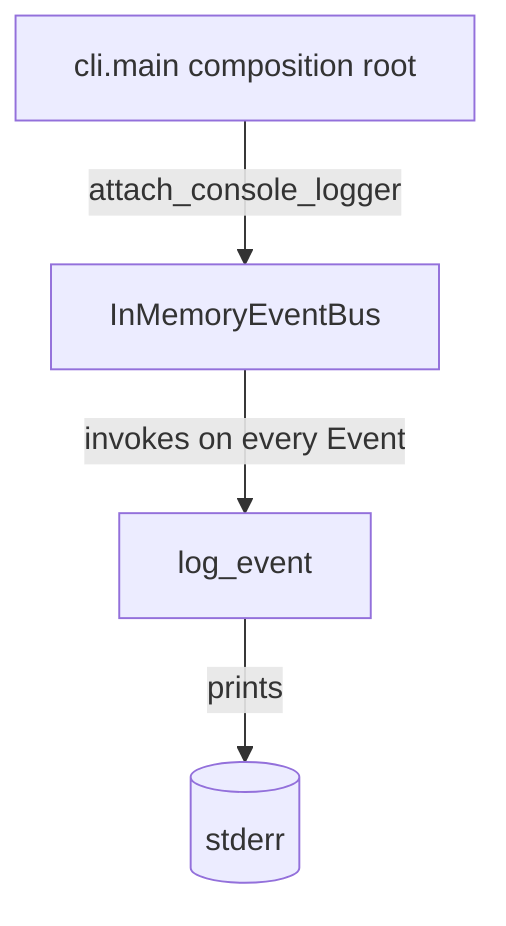

## `kernel/adapters/events/console_event_logger.py`

Provides `attach_console_logger`, which subscribes a `log_event` handler to every
`EventType` on a given `EventBus`, printing a one-line log to stderr. Phase 1's only
observability sink — replaced/augmented by a durable trace store in Phase 6.

**Inputs:** `attach_console_logger(EventBus)` called once from the CLI composition root.
**Outputs:** stderr log lines, one per published `Event`.
**Depends on:** `kernel.core.models` (`Event`, `EventType`), `kernel.interfaces.event_bus.EventBus`.
