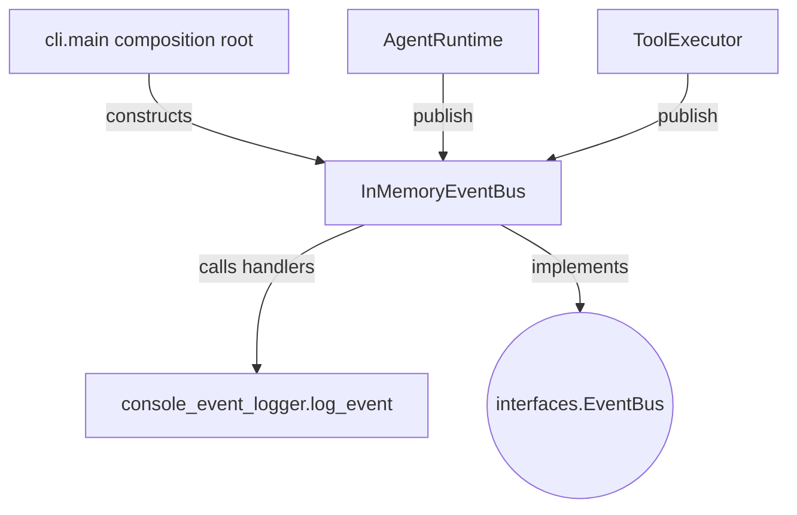

## `kernel/adapters/events/in_memory_event_bus.py`

`InMemoryEventBus` is a synchronous, in-process implementation of the `EventBus` protocol
— a `dict[EventType, list[handler]]` registry with synchronous dispatch on `publish`.

**Inputs:** `publish(Event)` from `AgentRuntime`/`ToolExecutor`; `subscribe(EventType, handler)`
from `console_event_logger.attach_console_logger`.
**Outputs:** synchronous handler invocations.
**Depends on:** `kernel.core.models` (`Event`, `EventType`), `kernel.interfaces.event_bus.EventHandler`.
