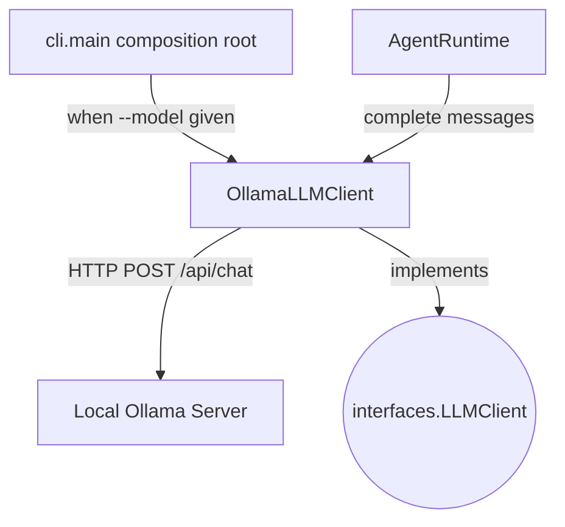

## `kernel/adapters/llm/ollama_llm_client.py`

`OllamaLLMClient` is a real `LLMClient` implementation that calls a local Ollama server's
`/api/chat` endpoint over HTTP via `httpx`. Selected by the CLI when `--model` is passed.

**Inputs:** `complete(list[Message])` called by `AgentRuntime` via the `LLMClient` protocol.
**Outputs:** assistant `Message` built from the Ollama HTTP response; an outbound HTTP
request to the local Ollama server.
**Depends on:** `kernel.core.models` (`Message`, `Role`), `httpx` (third-party).
