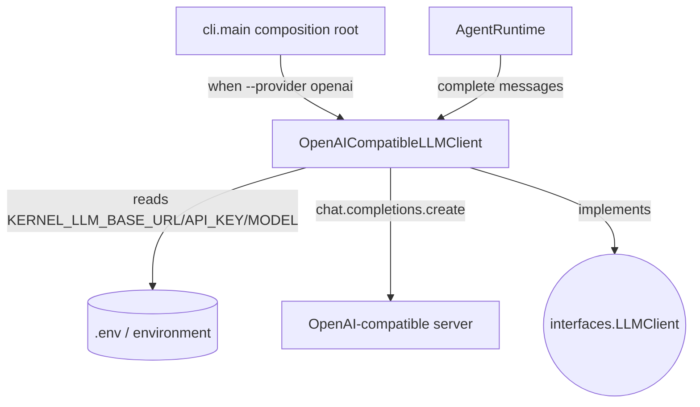

## `kernel/adapters/llm/openai_compatible_llm_client.py`

`OpenAICompatibleLLMClient` is a real `LLMClient` implementation that calls any
OpenAI-compatible `/chat/completions` endpoint via the `openai` SDK (e.g. a locally
tunneled model server). Configuration (`base_url`, `api_key`, `model`) comes from
`KERNEL_LLM_*` environment variables (loaded from a gitignored `.env`), never hardcoded.

**Inputs:** `complete(list[Message])` called by `AgentRuntime` via the `LLMClient` protocol;
`KERNEL_LLM_BASE_URL` / `KERNEL_LLM_API_KEY` / `KERNEL_LLM_MODEL` env vars at construction.
**Outputs:** assistant `Message` built from the endpoint's response; an outbound HTTPS/HTTP
request via the `openai` SDK.
**Depends on:** `kernel.core.models` (`Message`, `Role`), `openai` (third-party).
