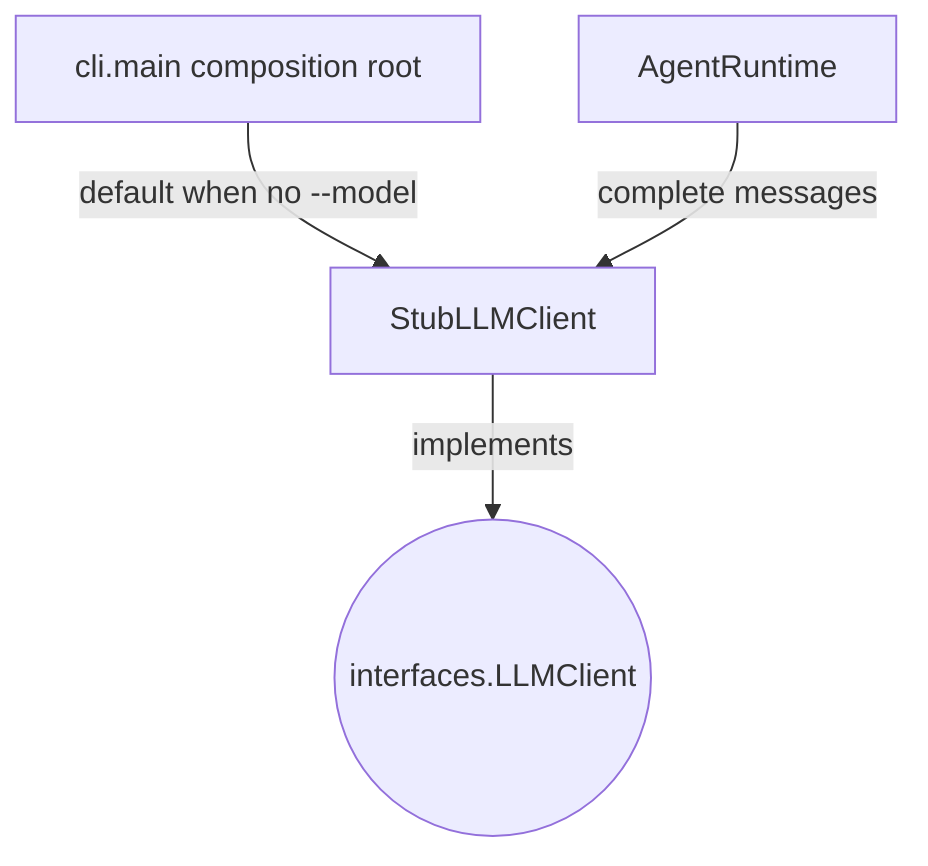

## `kernel/adapters/llm/stub_llm_client.py`

`StubLLMClient` is a deterministic, network-free `LLMClient` implementation used by tests
and as the CLI's default when no `--model` is given. Encodes a simple `echo:` convention
to deterministically trigger the `echo` tool for integration tests.

**Inputs:** `complete(list[Message])` called by `AgentRuntime` via the `LLMClient` protocol.
**Outputs:** canned assistant `Message`, optionally carrying a `ToolCall`.
**Depends on:** `kernel.core.models` (`Message`, `Role`, `ToolCall`).
