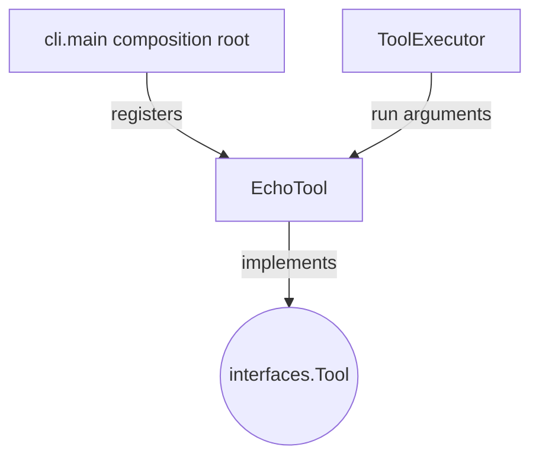

## `kernel/adapters/tools/echo_tool.py`

`EchoTool` is a minimal example `Tool` that returns its `text` argument unchanged. It exists
solely to prove the `ToolExecutor` / `AgentRuntime` tool-call round trip in Phase 1.

**Inputs:** `run(arguments: dict)` called by `ToolExecutor`.
**Outputs:** `ToolResult` echoing `arguments['text']`.
**Depends on:** `kernel.core.models.ToolResult`, `kernel.interfaces.tool.Tool`.
