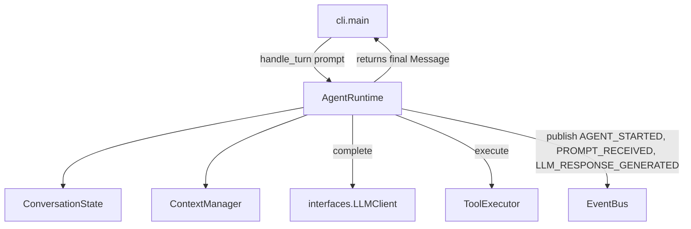

## `kernel/core/agent_runtime.py`

`AgentRuntime` is the single orchestrator of one conversational turn: it updates
conversation state, builds the context window, calls the LLM, and — while the LLM keeps
requesting tools (bounded by `max_tool_iterations`) — executes tools and loops back.

**Inputs:** `handle_turn(user_prompt: str)` called by `cli/main.py`.
**Outputs:** final assistant `Message`; events published through `EventBus`.
**Depends on:** `ConversationState`, `ContextManager`, `ToolExecutor` (all `core/`), and the
`LLMClient` / `EventBus` interfaces. Never imports `adapters/` or `cli/`.
