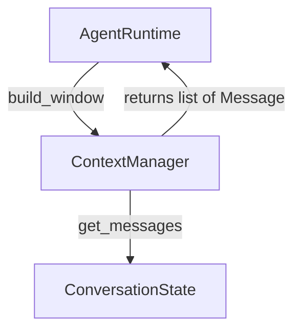

## `kernel/core/context_manager.py`

`ContextManager` builds the bounded message window sent to the LLM on each turn. Phase 1
implements a single "keep most recent N messages" strategy.

**Inputs:** `build_window(ConversationState)` called by `AgentRuntime`.
**Outputs:** bounded `list[Message]` returned to `AgentRuntime`, which passes it to
`LLMClient.complete`.
**Depends on:** `kernel.core.conversation.ConversationState`, `kernel.core.models.Message`.
