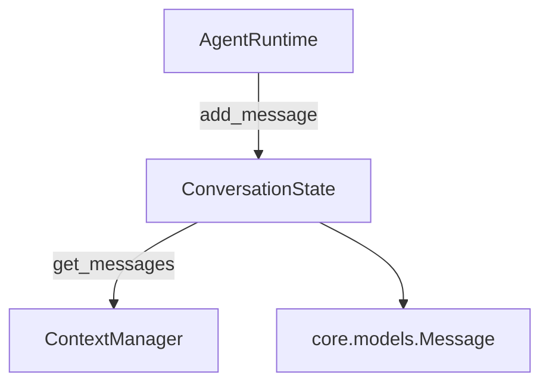

## `kernel/core/conversation.py`

`ConversationState` holds the ordered in-memory history of `Message`s for one session. It
has no windowing/pruning logic (that's `ContextManager`'s job) and no persistence (that
arrives with memory in Phase 5).

**Inputs:** `add_message(Message)` calls from `AgentRuntime`.
**Outputs:** `get_messages()` consumed by `ContextManager`.
**Depends on:** `kernel.core.models.Message` only.
