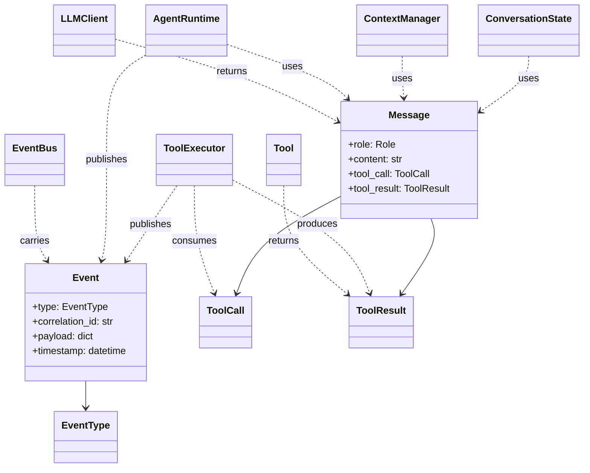

## `kernel/core/models.py`

Defines the core domain data shapes shared by every other module: `Role`, `Message`,
`ToolCall`, `ToolResult`, `EventType`, and `Event`. Pure data — no logic, no I/O, no
dependency on any other `kernel` module.

Everything else in `core/`, `interfaces/`, and `adapters/` imports these types — this file
has no outgoing dependencies within the project.
