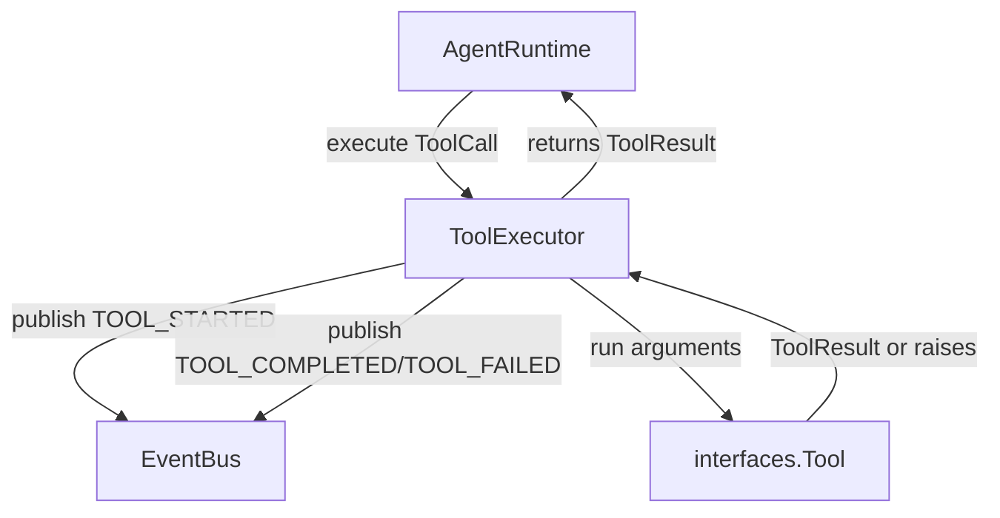

## `kernel/core/tool_executor.py`

`ToolExecutor` runs a single `ToolCall` against a fixed, manually-registered `dict[str, Tool]`
and reports `TOOL_STARTED` / `TOOL_COMPLETED` / `TOOL_FAILED` events. Tool exceptions are
caught and converted into an error `ToolResult` — they never propagate to the runtime.

**Inputs:** `execute(ToolCall, correlation_id)` called by `AgentRuntime`.
**Outputs:** `ToolResult` returned to `AgentRuntime`; `Event`s published to `EventBus`.
**Depends on:** `kernel.interfaces.tool.Tool`, `kernel.interfaces.event_bus.EventBus`,
`kernel.core.models` (`Event`, `EventType`, `ToolCall`, `ToolResult`).
