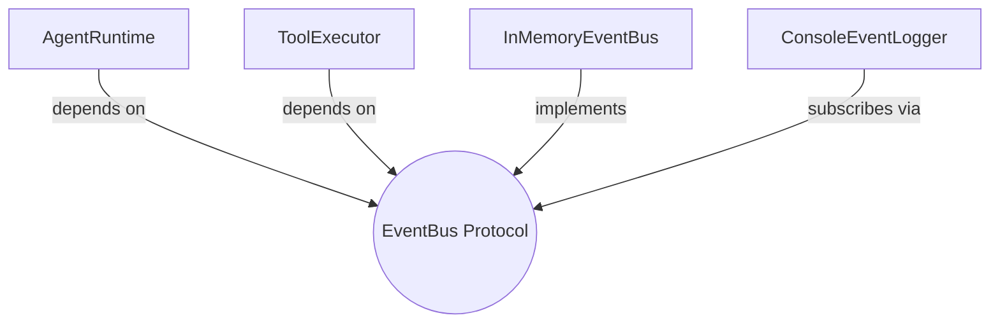

## `kernel/interfaces/event_bus.py`

Defines the `EventBus` `Protocol` used for all observability in the runtime — publishing
and subscribing to `Event`s. `AgentRuntime` and `ToolExecutor` depend on this; the concrete
implementation lives in `adapters/events/in_memory_event_bus.py`.

**Inputs:** none (a contract, not an implementation).
**Outputs:** none.
**Depends on:** `kernel.core.models` (`Event`, `EventType`).
