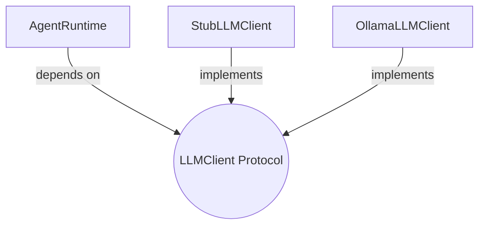

## `kernel/interfaces/llm_client.py`

Defines the `LLMClient` `Protocol` — the only way `core/` talks to a language model.
Concrete providers (Ollama, stub) live in `adapters/llm/` and implement this shape.

**Inputs:** none (a contract, not an implementation).
**Outputs:** none.
**Depends on:** `kernel.core.models.Message` (used in the method signature only).
