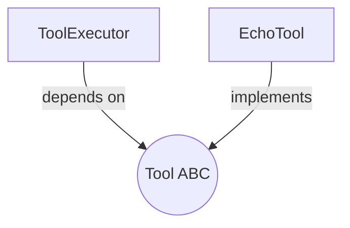

## `kernel/interfaces/tool.py`

Defines the `Tool` abstract base class that every agent-invocable capability implements.
`ToolExecutor` (core) depends on this contract; concrete tools live in `adapters/tools/`.

**Inputs:** none (a contract, not an implementation).
**Outputs:** none.
**Depends on:** `kernel.core.models.ToolResult` (return type of `run`).
